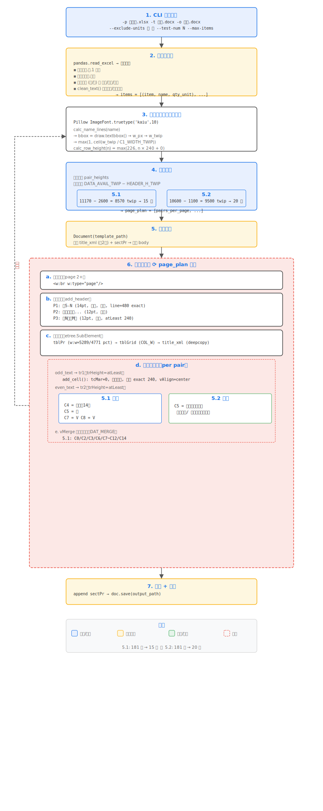

# 監造計畫書表格輔助工具

產製公共工程監造計畫書所需之表格，從詳細價目表（xlsx）自動轉換為排版完成的 Word 文件。

## 目錄結構

```
supervision_plan/
├── data/
│   ├── 02_成德-詳細價目表.xlsx    # 輸入母本
│   └── project_info.json          # 工程基本資料（input_project.py 產出）
├── tables/                        # 各表格轉換模組
│   ├── table5.1/                  # 表5.1 材料送審管制總表
│   ├── table5.2/                  # 表5.2 檢(試)驗管制總表
│   ├── table5.3/                  # 表5.3 材料設備品質抽驗紀錄表
│   ├── table5.4/                  # 表5.4 抽驗結果通知單
│   └── table5.5/                  # 表5.5 不合格改善追蹤表
├── common/
│   ├── docx_utils.py              # docx 共用工具（列高、合併、分頁）
│   └── docx_table.py              # 通用表格元件（黑實線框、段落格式、tcMar=0）
├── tools/
│   ├── input_project.py           # 工程基本資料輸入（CLI/GUI）
│   ├── calibrate_row_height.py    # 列高校準工具
│   ├── check_pages.py             # docx 頁數估算（Word COM）
│   └── backup.py                  # 備份工具
├── output/                        # 輸出 docx（已 gitignore）
├── build.py                       # 整本產製入口
├── AGENTS.md                      # AI 行為指南
├── requirements.txt
└── README.md
```

## 安裝相依套件

```bash
pip install -r requirements.txt
```

## 使用方法

### 工程基本資料輸入

```bash
python -X utf8 tools/input_project.py           # GUI 模式
python -X utf8 tools/input_project.py --cli     # CLI 模式
python -X utf8 tools/input_project.py --test    # 測試產出 Word
```

### 表5.1 材料送審管制總表

```bash
python -X utf8 tables/table5.1/convert_5.1.py --exclude-units 式 工
```

### 表5.2 檢(試)驗管制總表

```bash
# 測試（1 頁）
python -X utf8 tables/table5.2/convert_5.2.py --test-num 1 --exclude-units 工 式

# 正式輸出
python -X utf8 tables/table5.2/convert_5.2.py -o output/表5.2_完成.docx
```

### 表5.3 材料設備品質抽驗紀錄表（空白表單）

```bash
python -X utf8 tables/table5.3/convert_5.3.py --exclude-units 式 工
```

### 表5.4 抽驗結果通知單

```bash
python -X utf8 tables/table5.4/convert_5.4.py --exclude-units 式 工
```

### 表5.5 不合格改善追蹤表

```bash
python -X utf8 tables/table5.5/convert_5.5.py --exclude-units 式 工
```

### 檢查 docx 頁數

```bash
python -X utf8 tools/check_pages.py output/表5.2_完成.docx
```

## 執行流程



## 行高機制（適用 5.1、5.2）

| 參數 | 說明 | 值 |
|------|------|-----|
| LINE_H_TWIP | 每行文字高 | 240 twip（10pt 標楷體） |
| CELL_TOP_TWIP | 儲存格頂部餘裕 | 0（tcMar=0） |
| MIN_ROW_H_TWIP | 列高下限 | 226 twip |
| tcMar | 儲存格邊距 | 全部設 0 |
| trHeight hRule | 列高規則 | `atLeast` |
| 段落行距 | 文字高度規則 | `exact` at LINE_H_TWIP |

## 技術棧

- **Python** — 主程式語言
- **pandas / openpyxl** — 讀取詳細價目表
- **python-docx / lxml** — 產出 Word 文件
- **Pillow** — 文字寬度測量（行數計算，5.1、5.2）
